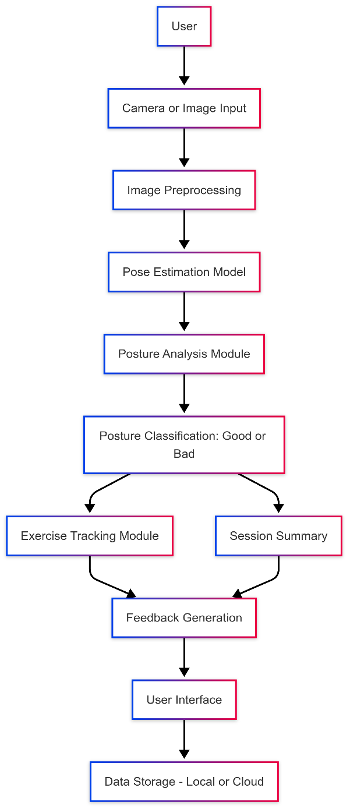
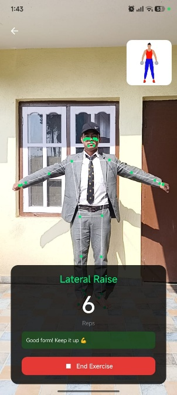
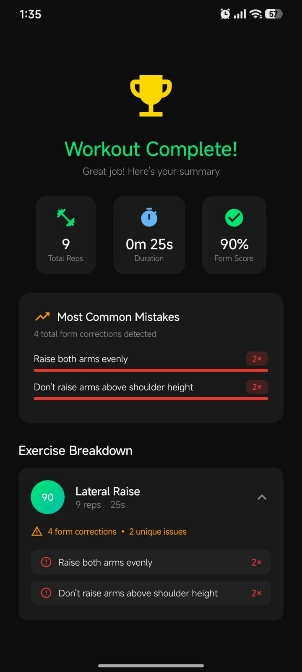

# SmartFit

SmartFit provides real-time posture analytics and feedback for common exercises using pose estimation and lightweight machine learning models. The project integrates MoveNet for landmark detection with on-device models to evaluate form, count repetitions, and provide corrective suggestions suitable for home workouts and remote coaching.

## Key Features
- Real-time pose estimation using MoveNet
- Rule-based and ML-driven form evaluation
- Rep tracking and session summaries
- Lightweight TensorFlow Lite models for on-device inference
- Simple mobile UI designed for accessibility and home use

## How it works (brief)
1. Camera captures user frames on the device.
2. MoveNet extracts body landmarks (keypoints) in real time.
3. Feature extractors compute angles and movement metrics from landmarks.
4. A form evaluator applies rules and ML predictions to detect deviations.
5. The system provides corrective feedback and updates the rep counter.

## Model & Data
- Pose estimation: MoveNet SinglePose Lightning (TensorFlow Lite)
- Training data references: public datasets such as COCO, MPII, and curated exercise samples
- Models are optimized for latency and mobile deployment

## Usage
- Grant camera permission when prompted.
- Select the exercise and follow on-screen instructions.
- The app shows live posture overlays, rep counts, and textual feedback.

## Evaluation & Results
The project includes evaluation charts and accuracy/loss curves demonstrating model performance on held-out validation data. Results show the approach provides reliable rep counting and useful corrective feedback for common exercises when the subject is clearly visible and the camera provides a steady view.

## Appendix (selected images)
The report appendix includes diagrams and screenshots used in the project. A selection of those images is included here for reference:

Images and additional figures are available in the `docs/images` folder.

---
