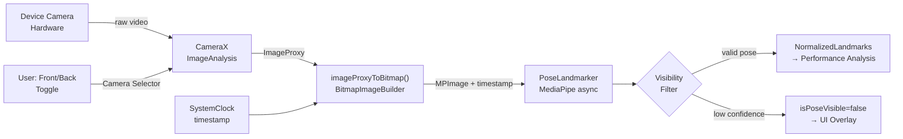
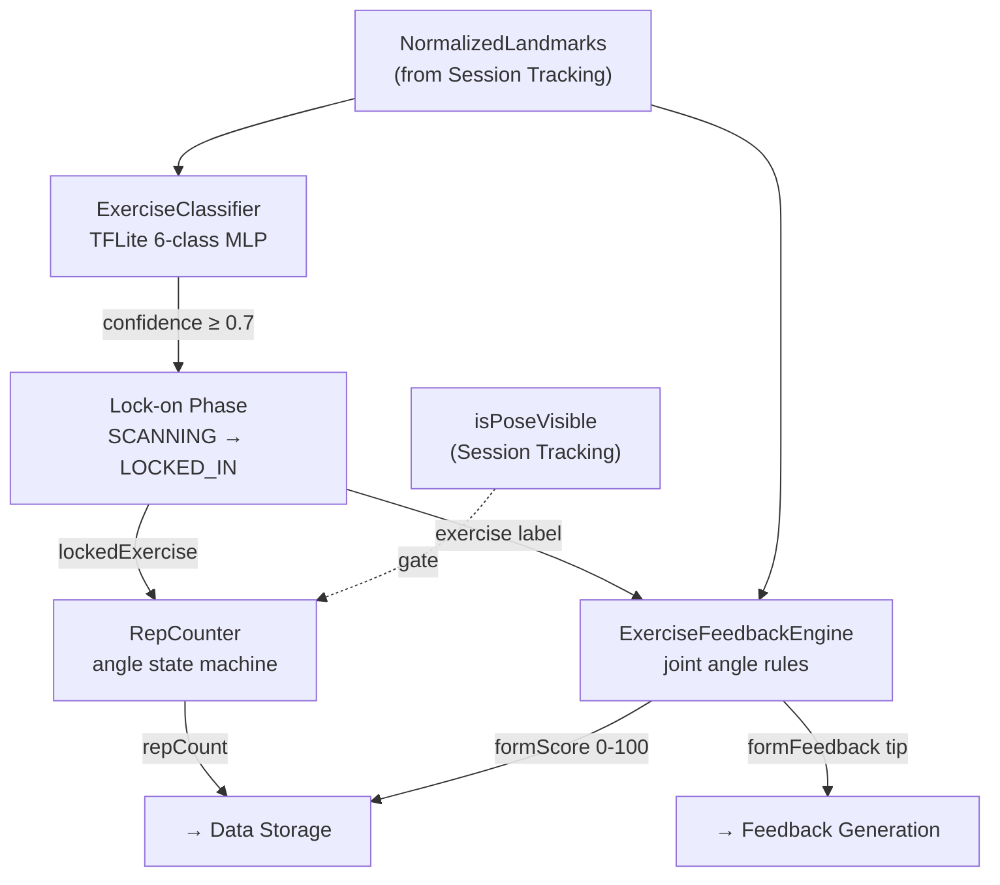
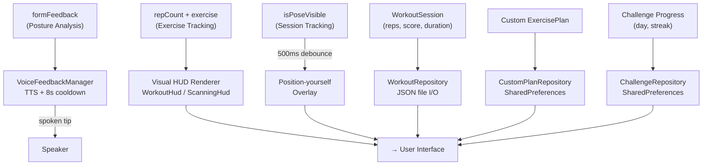
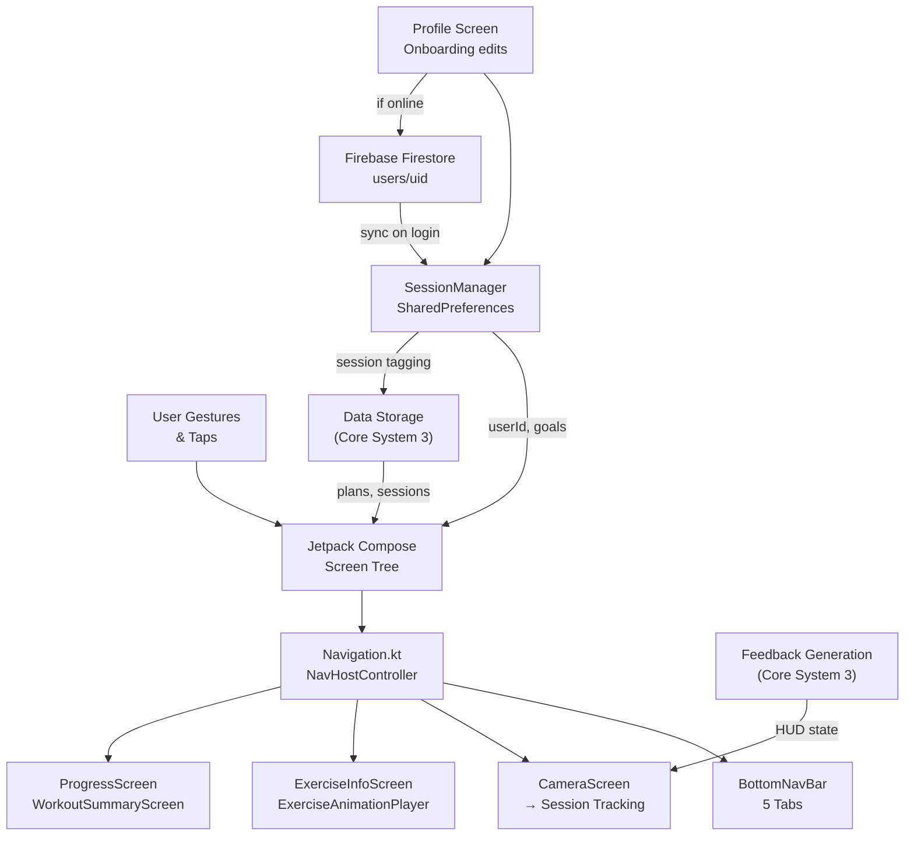
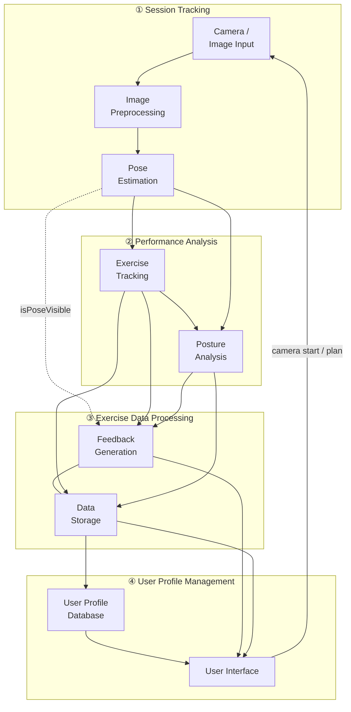

# SmartFit — System Architecture

---

## Core System 1 — Session Tracking

Captures raw video, preprocesses frames, and estimates body pose keypoints.

**Modules:** Camera / Image Input · Image Preprocessing · Pose Estimation

| Module | Input | Output |
|--------|-------|--------|
| Camera / Image Input | Device camera hardware, front/back toggle | `ImageProxy` frame |
| Image Preprocessing | `ImageProxy` | `MPImage` + timestamp |
| Pose Estimation | `MPImage` | `NormalizedLandmarks` list + `isPoseVisible` flag |

---

## Core System 2 — Performance Analysis

Analyses structured keypoints to classify exercises, count reps, and evaluate form.

**Modules:** Exercise Tracking · Posture Analysis

| Module | Input | Output |
|--------|-------|--------|
| Exercise Tracking | `NormalizedLandmarks` | `lockedExercise`, `repCount` |
| Posture Analysis | `NormalizedLandmarks` + exercise label | `formFeedback`, `formScore` |

---

## Core System 3 — Exercise Data Processing

Converts analysis outputs into audio/visual coaching and persists all workout data.

**Modules:** Feedback Generation · Data Storage

| Module | Input | Output |
|--------|-------|--------|
| Feedback Generation | `formFeedback`, `repCount`, `isPoseVisible` | Spoken tip (TTS), visual HUD |
| Data Storage | `WorkoutSession`, plans, challenge state | Persisted JSON / SharedPreferences |

---

## Core System 4 — User Profile Management

Handles all screens, navigation, and user identity/profile data.

**Modules:** User Interface · User Profile Database

| Module | Input | Output |
|--------|-------|--------|
| User Interface | Data from Storage, HUD state, user gestures | Rendered screens, navigation events |
| User Profile Database | Profile fields, auth state | User identity + goals for personalisation |

---

## Full Cross-System Overview

